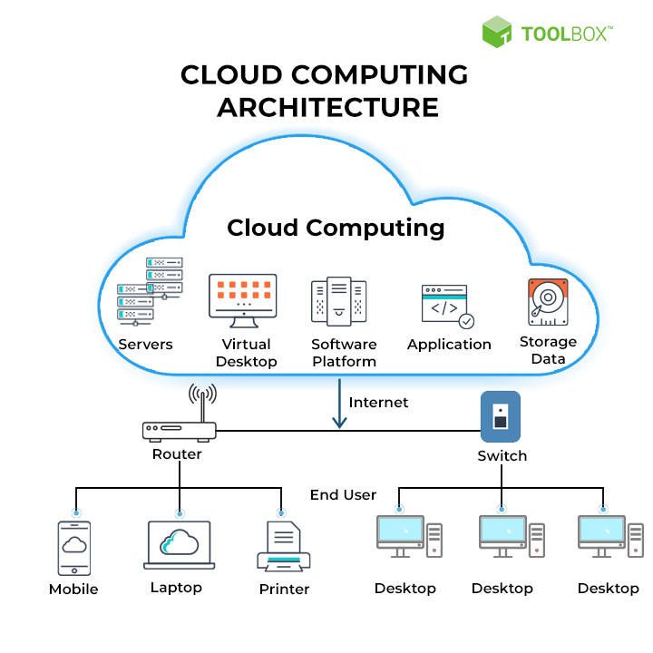

<h1 align="center">
    Cloud
</h1>

 

Let's talk about cloud and cloud services. What is a cloud? What is a cloud service?
Why do we need cloud services? How we can use cloud services?

 

## What is Cloud?

Simply put, the cloud is the Internet—more specifically, it's all of the things you can access remotely over the Internet. When something is in the cloud, it means it's stored on Internet servers instead of your computer's hard drive.

 

## What is Cloud Computing?

Simply put, cloud computing is the delivery of computing services—including servers, storage, databases, networking, software, analytics, and intelligence—over the Internet (“the cloud”) to offer faster innovation, flexible resources, and economies of scale.

 

    

 

## What are Cloud Services?

The term "cloud services" refers to a wide range of services delivered on demand to companies and customers over the internet. These services are designed to provide easy, affordable access to applications and resources, without the need for internal infrastructure or hardware.

### There are 3 types

- Infrastructure as a Service (IaaS)
- Platform as a Service (PaaS)
- Software as a Service (SaaS)

### SaaS

- Google Docs
- Google Maps
- Trello
- Netflix

### PaaS

- Google Colab
- Heroku
- AWS Elastic Beanstalk
- OpenShift

### IaaS

- AWS
- Digital Ocean
- Microsoft Azure
- Abrarvan

 

    

 

## Example

Now, let's get our hands dirty. We are going inside
Abrarvan to create a new VM and make a SSH connection to
our VM.

 

## Resources

- [https://edu.gcfgloabl.org](https://edu.gcfglobal.org/en/computerbasics/understanding-the-cloud/1/#:~:text=But%20what%20exactly%20is%20the,of%20your%20computer's%20hard%20drive.)
- [https://aws.com](https://aws.amazon.com/)
- [https://arvancloud.ir](https://www.arvancloud.ir/en)